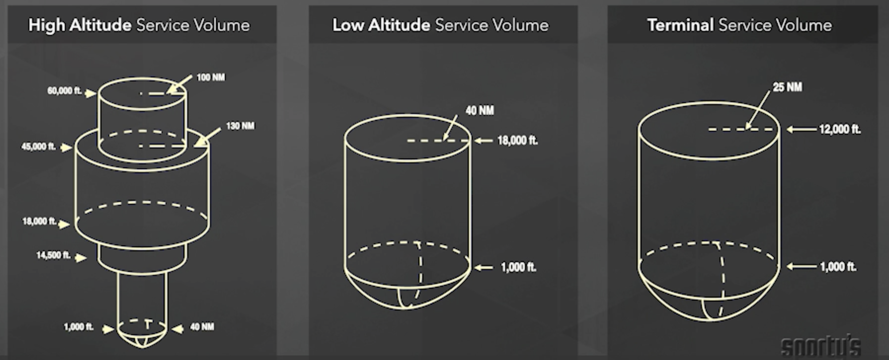

# Air Traffic Control and IFR

## ATC Routes

* ATS routes or air traffic services routes is a generic term that includes the 4 different sets of airways in the United States, as well as arrival and departure routes.
* Victor airways go from 1200 feet AGL up to but not including 18,000 feet MSL.  Practically the highest assigned altitude available on victor airways is 17,000 feet.
* High altitude airways, called Jet Routes, start at 18,000 feet MSL and extend up to and include flight level 450.  Aircraft above flight level 450 navigate by point to point or direct navigation.
* Published RNAV routes are found on both the high and low altitude charts.  They are printed in blue with magnetic reference bearings.
* Q-routes are found on the high-altitude charts.  T-routes are low altitude RNAV routes generally established for transition around busy terminal airspace.
* VOR frequency collision is evidenced by aural screech and CDI needle oscillations

## En-Route IFR
* Minimum En-Route Altitude (MEA): guarantees VOR navigation coverage, but not communications or radar coverage
* Minimum Obstruction Clearance Altitude (MOCA): guarantees VOR navigation coverage within 22 NM of the station
* Terminal Radar Approach Control Facility (TRACON): 30 mile diameter from primary airport up to 10-12,000 feet
* Notify a controller if you are unable to maintain 500 FPM climb or descent rate
* Guaranteed terrain clearance along Victor Airways
  * 1000 feet non-mountainous terrain, 2000 feet mountainous terrain
  * Airways are 4 NM wide on each side

## Departing the Terminal Area
* Standard Instrument Departure (SID): graphic departure procedure designed by ATC to standardize traffic flow, ensure aircraft separation and provide obstacle clearance from the terminal area to the en route environment
* Obstacle Departure Procecure (ODP): textual ODPs are located in the Takeoff Minimums section in mobile apps, while graphic ODPs are grouped in with the SIDs, and usually include the word “Obstacle” in the title to differentiate them from traditional SIDs
  * Flown when weather is less than VFR and not assigned a SID
* Standard IFR climb procedure
  * Climb at least 200 feet per nautical mile
  * Climb to 400 AGL before turning
* Check takeoff minimums on departure runway for published minimums that exceed these (152 feet per nautical mile)

## Arriving the Termainal Area
* Standard Terminal Arrival Route (STAR)

## Radio Failure
* If you have a radio communications failure in instrument conditions, continue on the last assigned route and altitude, or at the minimum en route altitude or altitude ATC told you to expect, whichever is higher. Set your transponder to 7600, the code for radio failure
* If the radio failure occurs in VFR conditions, or if you encounter VFR after the failure, continue the flight under VFR, and land as soon as practicable
* Must report to ATC when
  * Encountering hazardous weather and any unforecast weather conditions
  * Any information relating to the safety of the flight
  * If any avionics malfunction
  * If you deviate from your clearance
  * When vacating an altitude for a newly assigned altitude
  * Altitude change when VFR on top
  * 500 FPM cannot be maintained in a climb or descent
  * Airspeed varies by 5% or 10 knots (whichever is greater)
  * Time & altitude when reaching an assigned holding fix
  * Departing a holding fix
  * Executing a missed approach
  * Minimum fuel status (emergency possible if undue delay)
* Non-radar environment reports to ATC
  * Time & altitude passing designated reporting points
  * Time estimate over a designated reporting point off by more than 3 minutes
  * Leaving the FAF (Final Approach Fix) inbound on a nonprecision approach
  * Leaving the OM (or OM substitute) inbound on a precision approach

## OROCA
* Off Route Obstruction Clearance Altitude
* 1000 vertical feet of clearance in non-mountainous terrain, 2000 in mountainous
* Similar to MEF on a VFR chart
* Does not guarantee radial/radar coverage
* Will never be cleared below minimum sector altitude

## GPS
* Must have alternate form of approach navigation if non-WAAS GPS
* Current database not required for en route GPS, just must verify waypoints are current
* Current database required to fly GPS approach
* Receiver will not allow approach if RAIM is not available at destination

