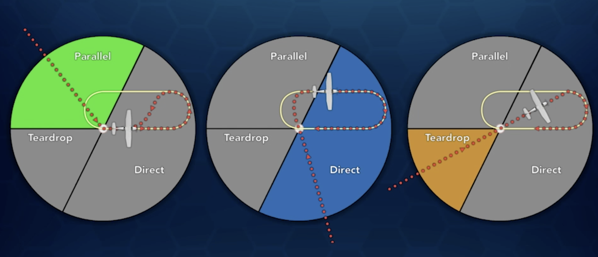
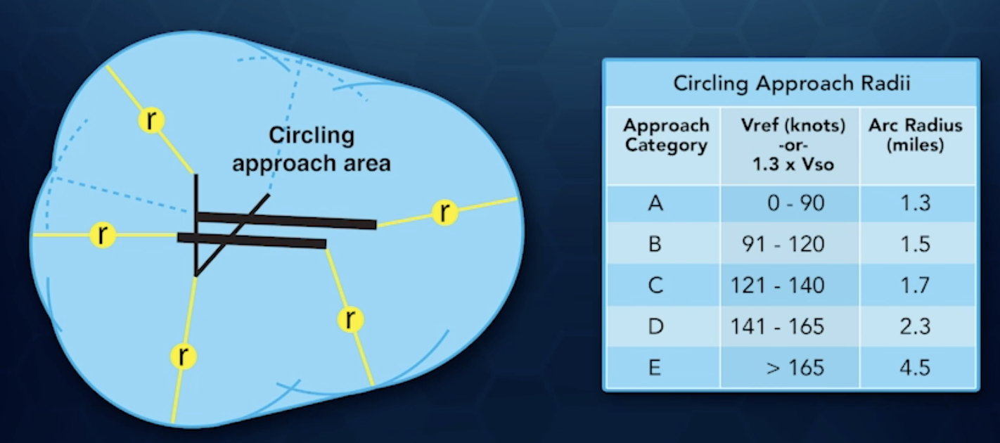
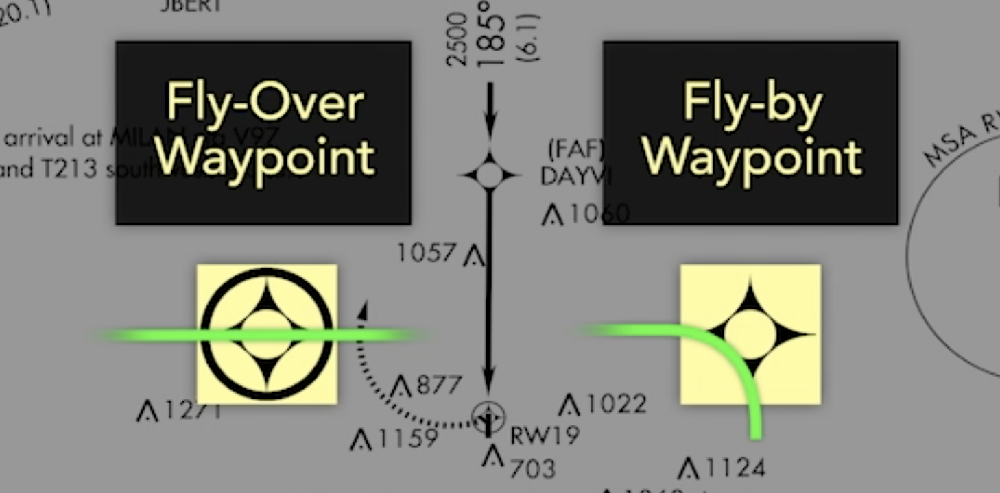

# Instrument Approaches

## Non-Precision Approach
* Flown to a Minimunm Descent Altitude (MDA)

## Precision Approach
* Flown along vertical glide path to a Decision Altitude (DA)

## MDA/DA
* Decision Height: DA but AGL instead of MSL
* To fly below MDA or DA, must have runway, runway markings, approach lights, or runway lights in sight
* Visibility must be less than specified
* Descent rate must be standard rate
* If an approach is not straight into a runway, approach is identified with a letter such as `VOR-A`
* Multiple straight-in approaches of same type start at end of alphabet and work backwards

## Procedure Turn
* Not authorised when:
  1. `NoPT` on chart
  2. `Procedure Turn NA` (not authorized) on chart
  3. Radar vectors to final
  4. Timed approach from hold

* Computer Navigation Fix (CNF)
  * May be found in navigator databse with 5-letter database

## Minimum Safe Altitude
* Guarantees 1000' obstacle clearance in protected area
* No assurance of Navaid reception

## Aircraft Approach Categories
* Based on final approach speed, VSO x 1.3
* A: < 91 knots
* B: 91 - 120 knots
* C: 121 - 140 knots
* D: 141 - 165 knots
* `6000 - 1 472 (500-1)`: minimums are 6000 ceilings and 1sm; at 6000 MSL, will be 472 feet above TDZE

## Localizier
* Full localizer spread is 5° whereas a VOR is 20°
* Localizer identifiers prefixed with an `I`, like `I-CDN`
* Varies from 3° to 6° so that it is 700 feet wide at the approach end of the runway
* Full scale deflection on either side is 350 feet
* Localizer Directional Aid (LDA): not aligned with centerline within 3° (required to be called a localizer)
  * Most do not have glideslopes
  * Width still approximately 5°
* Simplified Directional Facility (SDF)
  * No I identifier
  * Either 6° or 12° wide
  * No glideslopes
  * Centerline may be at angle to runway (not aligned with runway)
* 90 Hz signal on left, 150 Hz on right
* Front course of localizer is usually used for navigation
* 1 dot = 100 feet 0.6 NM from tne runway
* 1 dot = 350 feet 5 NM from tne runway
* Limit heading changes to 5° or less when outside outer marker
* When inside the outer marker (4-7 NM), lmit heading changes to 2° at a time; use rudder
* Back course: disregard any glideslope indications, as they are false indications

## Glideslope
* Marker Beacon
  * Ellipse
  * 4800 feet wide, 2800 feet thick
  * 4-7 NM from approach end of runway
  * Usually coincides with intercept of glideslope
* ILS Categories
  * Category I
    * lowest possible DH 200 feet
    * Flight visibility 1/2 mile (1800 RVR if runway has TDZL/CL)
  * Category II
    * DH 100 feet
    * Flight visibility 1200 feet RVR
  * Category III
    * IIIa
      * DH < 100 feet, RVR > 699 feet
    * IIIb
      * DH < 50 feet, RVR 150-699 feet
    * IIIc
      * DH 0 feet, visibility 0 feet
* Glideslope is a separate UHF frequency
* Designed to provide a threshold crossing height of 55 feet
* Optimal glideslope is 3°
* Disregard indications unless a glideslope is indicated by a slope
* False glideslopes exist above the glideslope
* Lowest possible false slope would require a descent of more than 1000 feet per NM
* More precise than localized
* Total depth is 1.4° (0.7° above and below centerline)
* Part of glideslope that intercepts a localizer is a glidepath
  * At OM, center of glidepath is about 1800 feet above runway, descending to 200 feet 0.5 NM from the threshold
  * At OM, full scale above to full scale below is ~800 feet
* At 90 kts gs, need about 478 fpm descent
* Approximate descent rate with (groundspeed / 2) * 10
* If deviation is more than half scale, power change required; otherwise, only change pitch
  * Changes of around 50 RPM or 1/2 in manifold pressure
* **LPV and LNAV/VNAV approaches feature an electronically generated glideslope**
  * Require WAAS
  * Baro-VNAV uses a flight management computer to generate a glideslope based on air pressure

## Unusual procedures
* Sidestep maneuever used for parallel runways NOT more than 1200 feet apart
* Timed approach from holding fix only made for towered airports

## VOR approaches
* Intercept radial at 30° or 45°
* Do not change heading until you have at least a 1 dot deflection
* Heading change should not be more than 10°
* At extreme distances, use as much as 30° brackets
* Complete Before Landing check before reaching FAF
* In a non-precision approach, a descent rate of 800 fpm works well for most GA aircraft
* Know the initial move of a missed approach (i.e. whether to turn or fly straight)
* FAR 91.175: criteria for descending below MDA
  * Runway/runway environment in sight
  * In a position from which a normal descent to landing can be made at a normal rate with normal maneuvers
  * Minimum flight visibility specified for the approach being used

## 5 Ts
* Time
  * Set timer
* Turn
  * Turn to appropriate heading
* Twist
  * Set OBS to outbound course
* Throttle
  * Reduce power for descent if required
* Talk
  * Report to ATC if required

## Holding
* Unpublished hold: ATC will give you
  * Direction of hold (N, NE, SE, etc)
  * Holding fix
  * Bearing or airway
  * Leg length if DME or RNAV hold
  * Turning direction
  * Expect further clearance time
* Maximum speeds
  * Up to 6000 feet: 200 KIAS
  * 6000 - 14000 feet: 230 KIAS
  * Above 14000 feet: 265 KIAS
  * Different speed limit may be charted on the hold
  * Slow airplane to holding speed at least three minutes before reaching holding fix
* Time
  * At or below FL14: 1 minute
  * Above FL14: 1.5 minutes
* VOR hold
  * Start turn at reversal of TO/FR indicator
  * Start timing outbound leg when abeam the fix (or outbound turn is completed)
* Use standard rate turns
* Protected area
  * 60% on protected side, 40% on unprotected side
  * Smallest protected airspace is 6.7 NM wide (up to 4000 feet)

## Circling Approaches
* Not lined up with runway or are used to land on another runway, or requires an excessive descent on final approach segment
* Different minimums apply
* For an approach to be straight-in, angle between final approach course and centerline of runway must be within 30° (15° for GPS)
* Approaches without straight in landing minimums are designated by a letter (i.e. `VOR/DME-A`)
* Size of circle flown is related to speed of the aircraft squared
* Minimum obstacle clearance is 300 feet inside the circling area at the circling MDA

* `C` symbol next to circling minimums indicate expanded protected area
* Fly circling approach as high as pattern altitude if weather permits
* Can land straight in if weather allows
* Missed approach MUST START at the missed approach point

## VDP
* Defined point on the final approach course from which, providing the runway is in sight, a normal descent from the MDA to the touchdown portion of the runway would be obstruction free
* Usually DME or GPS fix
* Descent below MDA should not occur before passing VDP and having the runway in sight
* **Only apply to non-precision approaches**

## GPS Approaches
* Most include a holding pattern at one of the IAF to get established when arriving from opposite direction
* Receiver database must be current
* Types
  * LPV
    * Most precise type of approach available
    * Localizer Performance with Vertical guidance
    * Both lateral and vertical guidance
    * Requires WAAS
    * Final approach course width narrows as you approach the runway
    * Terminates at a DA, not a MDA (i.e. missed approach executed immediately at the DA)
    * LP: variation of LPV
      * Requires WAAS
      * Provides same angular approach course
      * Uses step down fixes for descent and terminates at an MDA
      * Lower minimums than LNAV option
  * LNAV/VNAV (or L/VNAV)
    * Barometric altimeter input
  * LNAV
    * Most basic type
    * Provides left/right course guidance with step-down fixes for descents down to MDA
    * Missed approach point identified by waypoint
    * Any vertical guidance provided by GPS is advisory only
      * MDA rules still apply
      * Only helps with stabilizing approach
* Advisory glidepath (LP or LNAV approach)
  * Can provide advisory vertical guidance to provide stabilized descent from FAF to runway
  * Not required to fly glideslope
  * Does not lower minimums
  * Identified as LNAV+V or LP+V
* GPS-based holding patterns often defined by distance
* Fly-over waypoint: must fly over it
* Fly-by waypoint: can fly by it when turning, not right over it

* Terminal Arrival Area (TAA)
  * Quadrants that provide minimum safe altitudes based on location and distance from waypoints
* GPS terminal mode changes full scale deflection to 1NM
  * Full scale deflection is 2NM enroute
* Grey-shaded line indicated visual segment is clear of obstructions on a 34:1 slope
  * If missing, the visual segment is not free of obstructions, so use caution and do not follow advisory glideslope all the way to the threshold
